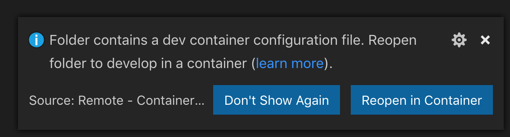
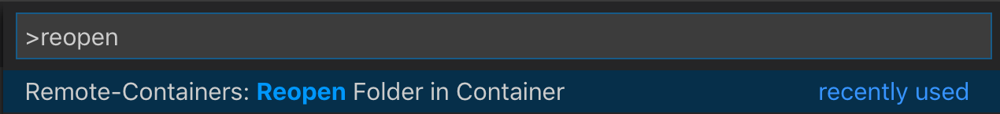
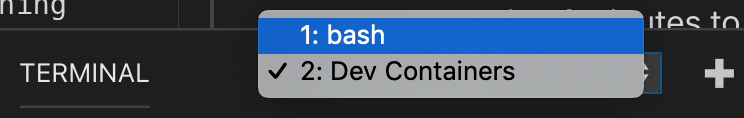
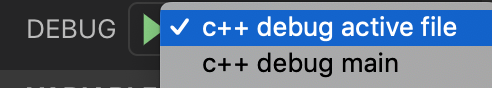

# C++ Project Template
This is a C++ project template using the meson build system.

# Getting Started
- It is recommended to use a VSCode devcontainer, however if you want to work on the project without a devcontainer, you can find all the required dependencies in: `./devcontainer/Dockerfile` and manually install them on your machine
- Download and install Docker Desktop: https://www.docker.com/products/docker-desktop
  - ⚠️NOTE: Docker Desktop for Windows requires the Hyper-V Windows feature which is not available on Home-edition. If you are running Windows Home-edition, install Docker Toolbox instead: https://docs.docker.com/toolbox/toolbox_install_windows/
- Make sure docker is running
- Download and install VSCode
- Open this project in VSCode
- There will be a popup asking if you want to open it in a devcontainer:

- Click "Reopen in Container"
- If you don't see the popup, you can also open the devcontainer with a command. 
  - open the Command Palette in VSCode: `ctrl+shift+p` (`cmd+shift+p on mac`)
  - type "reopen" and hit enter
  
- The first time you are opening the devcontainer it will take a couple of minutes to install. But if you reopen it again at a later moment it should only take a matter of seconds.
- Once the devcontainer is up and running you'll see the files in your project reappear on the left
- Open bash in the VSCode Terminal tab:

  - ℹ️If you don't see a TERMINAL tab in the bottom panel of your screen, hit ``ctrl+` ``
- Cool, now you are fully set up to begin developing on the project!

# Building
- To initialize the build setup using meson run: `meson build` in the terminal.
- A folder with the name "build" has now appeared in your project, but no binaries have been built yet
- To build the binaries run: `ninja -C build`
- Now you can run the main file: `./build/src/main.cpp.executable`
- Take a look at the `meson.build` files in the project root, src and test directories to understand how the build process works.

# Testing
There are 2 ways of running the tests:
- `meson test -C build`
- `ninja -C build test`

Both  of these commands have their own special use cases:
- Running a test under GDB
  - `meson test -C build --gdb 'my gtest test'`
- Running the tests under valgrind
  - `meson test -C build --wrapper=valgrind`
- Compiling a single test
  - `ninja -C build test/math/math-test.cpp.executable`

If you have already compiled the tests you can of course also run a specific test like so: `./build/test/math/math-test.cpp.executable`

## GoogleTest
The project includes the GoogleTest testing framework, look at `my-gtest` for an example.
GoogleTest documentation can be found here: https://github.com/google/googletest/blob/master/googletest/docs/primer.md

## Code Coverage
You can generate a code coverage report of your tests by running:
`ninja -C build cov`
The coverage report should appear under `build/meson-logs`. You can open `index.html` in your browser for details.

# Code Quality
This project includes numerous tools that can help you make sure that the quality of the code is on par. 

## Auto Formatting
You may already have noticed that the code gets autoformatted when you save. This project is using `clang-format` to achieve that.
To run `clang-format` on the entire project run:
`ninja -C build clang-format`

## Static Analysis
Static analysis tools parse your source code for possible causes of bugs and violations of code style rules.
This project supports the following 3 static analyzers:
- `ninja -C build cppcheck`
- `ninja -C build clang-tidy`
- `ninja -C build scan-build`

## Dynamic Analysis
Dynamic analysis tools do not parse the source code, but execute the compiled files. This project supports `Valgrind`.
- `meson test -C build --wrapper=valgrind`
- `valgrind build/src/main.cpp.executable`

# Debugging
The devcontainer comes with gdb installed and by default all source files are compiled with debugging support enabled. 
To make life easier for you we've included 2 debugging tasks in the VSCode setup.
Click the debug window icon on the left or use the short cut ctrl+shift+d (cmd+shift+d on mac).
You can see the following debug tasks:

You can run the debug task by clicking the green play icon. 

Alternatively, you can press F5 to run the currently selected debug task.

⚠️NOTE: The "debug active file" task will not work if your active file does not have a meson configuration to be compiled to an executable. In case of an error look at the corresponding `build.meson` to make sure that the file you are trying to debug is being compiled into an executable. 

You can create breakpoints by clicking left of the line numbers in VSCode.

Try debugging main and then try debugging a test.

You can also run gdb manually if you prefer that: `gdb build/src/main.cpp.executable`