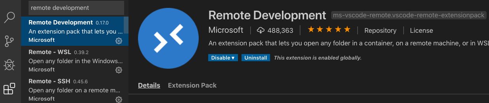

# C++ Project Template
This is a C++ project template using the meson build system.
There are two ways of testing out this project.

1. Use the ieng6 lab machines. 
2. Use a devcontainer on your own computer.

ℹ️ You can find a cheatsheet of important commands in [COMMANDS_CHEATSHEET.md](COMMANDS_CHEATSHEET.md)

## Getting Started with ieng6
If you don’t want to setup a devcontainer on your machine, you have the option to remotely connect to the lab machines (a.k.a. ieng6) using ssh or physically work in the lab. No additional setup is necessary for you to do, as the lab computers are already equipped with all the tools that you need to work on your PA. The only major difference is, however, that you will not be able to use VSCode to write your code - you will have to use VIM (like you did in CSE 30) to write your code and use commands on the terminal to compile and run your program.  Here’s a step by step guide for you to get started:

**1. Connect to ieng6** (skip this step if you are physically working on a lab machine)
If you’re on a Mac, you can open a terminal and use the command below and enter your password when prompted to connect to ieng6:

`ssh <your_cse_100_account>@ieng6.ucsd.edu`

For windows users, we encourage you to use the super convenient tool MobaXterm.

**2. Get the starter code**
This step is given to you on the write-up, but in summary, you have to clone the starter code repository by running the command below and enter your github username and password when prompted:

`git clone <the-url-provided-in-the-writeup>`


Everything from this point on is the same as what you would do if you were working in a devcontainer, but here’s a concise guide to compiling and running your code. 
 
**3. Compiling your code**
Go into the root directory of your project:

`cd <sander, please put the name of the repo>`

To compile your code run

```
meson build
ninja -C build test
```

More information on meson and ninja is provided further below in this README.

**4. Running executables**
If you run ls now after compiling, you’d see there is a new directory called `build`. This directory contains the compiled binary executables that you can run. For example, to run main.cpp from the BST portion of the assignment, run the command below from the root folder of your project:

`./build/test/my-gtest/my-gtest.cpp.executable`

**5. Running unit tests**
To run your unit tests, in your project root directory, run

```
meson build
ninja -C build test 
```

More information about testing is provided further below in this README.


## Getting Started with the Devcontainer
- ⚠️NOTE: Windows users, if you are running Windows Home edition, first read the note below the next item!
- Download and install Docker Desktop: https://www.docker.com/products/docker-desktop
  - ⚠️NOTE: Docker Desktop for Windows requires the Hyper-V Windows feature which is not available on Home-edition. If you are running Windows Home-edition, install Docker Toolbox instead: https://docs.docker.com/toolbox/toolbox_install_windows/
- Make sure docker is running
- Download and install VSCode
- Open VSCode, click the "Extensions" icon on the left and install the "Remote Development" extension by Microsoft
 
- Open this project in VSCode
- There will be a popup asking if you want to open it in a devcontainer:

- Click "Reopen in Container"
- If you don't see the popup, you can also open the devcontainer with a command. 
  - open the Command Palette in VSCode: `ctrl+shift+p` (`cmd+shift+p on mac`)
  - type "reopen" and hit enter
  
- The first time you are opening the devcontainer it will take a couple of minutes to install. But if you reopen it again at a later moment it should only take a matter of seconds.
- Once the devcontainer is up and running you'll see the files in your project reappear on the left
- Open bash in the VSCode Terminal tab:

  - ℹ️If you don't see a TERMINAL tab in the bottom panel of your screen, hit ``ctrl+` ``
- Cool, now you are fully set up to begin developing on the project!

# Building (Compiling And Running Executables)
- This project uses the `meson` build system along with `ninja`. In short, `meson` is comparable to `cmake`, it helps you configure your build. And `ninja` is comparable to `make`, which helps you actually build your binaries. `Ninja` uses the file called `compile_commands.json` in the build directory generated by `meson` to find out how to build your binaries. You can find more information on `meson` here: https://mesonbuild.com/
- To initialize the build setup using meson run: `meson build` in the terminal.
- A folder with the name "build" has now appeared in your project (but no executables have been built yet)
- To compile all the executables type: `ninja -C build` (`-C build` means we're first going into the `build` directory before running any of the ninja commands)
- To compile a single executable after build setup, type: `ninja -C build` followed by the path of the executable. For instance, to compile main in bst folder, type `ninja -C build test/my-gtest/my-gtest.cpp.executable`
- All the executables are under `./build/test/`. For instance, to run the main executable in bst folder, type: `./build/test/my-gtest/my-gtest.cpp.executable`
- (Take a look at the `meson.build` files in the project root, src and test directories to understand how the build process works.)

# Testing
There are 2 ways of running the tests:
- `meson test -C build`
- `ninja -C build test`

Both  of these commands have their own special use cases:
- Running a test under GDB
  - `meson test -C build --gdb 'my gtest test'`
- Running the tests under valgrind
  - `meson test -C build --wrapper=valgrind`
- Compiling a single test
  - `ninja -C build test/math/math-test.cpp.executable`

If you have already compiled the tests you can of course also run a specific test like so: `./build/test/math/math-test.cpp.executable`

## GoogleTest
The GoogleTest framework allows you write atomic tests for your code without calling that test in a main or fitting it into your existing set of tests. 
Look at `my-gtest` for an example.

To write a test, use the `TEST` macro:
```cpp
TEST(SuiteName, TestName) {
    // Test code goes here
}
```

The GoogleTest framework uses assertions to determine whether a test has passed or failed. For instance, here are some of the assertions available:

- `ASSERT_EQ(val1, val2)` - Fails the test if the two values are not the same (note: this uses the `==` operator, so for pointers, it looks for pointer equality instead of equality between the two underlying objects).
- `ASSERT_NE(val1, val2)` - Fails the test if the two values are the same.
- `ASSERT_GT(val1, val2)` - Fails the test if `val1 <= val2`.
- `ASSERT_GE(val1, val2)` - Fails the test if `val1 < val2`
- `ASSERT_LT(val1, val2)` - Fails the test if `val1 >= val2`
- `ASSERT_LE(val1, val2)` - Fails the test if `val1 > val2`

You can learn more about writing tests from the [GoogleTest documentation](https://github.com/google/googletest/blob/master/googletest/docs/primer.md).

## Code Coverage
Calculating code coverage is a way of measuring the quality of your test suite. 
A code coverage report shows the lines of code that were executed by your tests. 
This will give you insight into the weaknesses in your test suite as you can easily see which lines of code are not yet tested.

You can generate a code coverage report of your tests by running:
`ninja -C build cov`
The coverage report should appear under `build/meson-logs/coveragereport`. You can open `index.html` in your browser to see the full report.

If you are ssh'd into ieng6, you will need to download the coverage report to your computer first before you can open it in a browser.

# Tools for Code Quality
This project includes numerous tools that can help you make sure that the quality of your code is on par. 

## Auto Formatting
If you're working in a devcontainer, you may already have noticed that the code gets autoformatted when you save. This project is using `clang-format` to achieve that.
On ieng6, you'll have to run `clang-format` yourself.

To run `clang-format` on the entire project run:
`ninja -C build clang-format`

## Static Analysis
Static analysis tools parse your source code for possible causes of bugs and violations of code style rules.
They will notify you of suspicious looking code that may have a bug in it.

This project supports the following 3 static analyzers:
- `ninja -C build cppcheck`
- `ninja -C build clang-tidy`
- `ninja -C build scan-build`

## Dynamic Analysis
Dynamic analysis tools do not parse the source code, but execute the compiled files. This project supports `Valgrind`.
- `meson test -C build --wrapper=valgrind`
- `valgrind build/src/main.cpp.executable`

# Debugging
Both the devcontainer and ieng6 come with gdb installed and by default all source files are compiled with debugging support enabled. 

You can run gdb like this: `gdb build/src/main.cpp.executable`

Try debugging main and then try debugging a test.

## Debugging in the devcontainer
In the devcontainer we've also included 2 debugging tasks in the VSCode setup.
Click the debug window icon on the left or use the short cut ctrl+shift+d (cmd+shift+d on mac).
You can see the following debug tasks:


You can run the debug task by clicking the green play icon. 

Alternatively, you can press F5 to run the currently selected debug task.

⚠️NOTE: In case of an error when running a debug task the first thing to try is usually to delete your build dir and generate it again using `meson build` and `ninja -C build`.
⚠️NOTE: The "debug active file" task will not work if your active file does not have a meson configuration to be compiled to an executable. In case of an error look at the corresponding `build.meson` to make sure that the file you are trying to debug is being compiled into an executable. 

You can create breakpoints by clicking left of the line numbers in VSCode.
